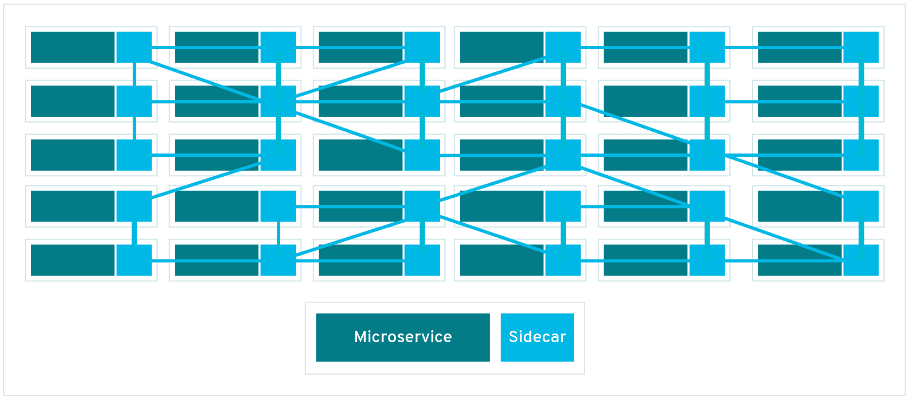

# **RESILIÊNCIA E SERVICE MESH**

Muito provavelmente você já ouviu falar na arquitetura de microsserviços. Essa arquitetura consiste em aplicações, com escopo delimitado e de responsabilidade única, que são distribuídas na rede para formar um sistema maior e mais robusto. Como consequência, de maior complexidade também. Saber como administrar e organizar este tipo de sistema é uma tarefa muito importante (e difícil) para obter o melhor desempenho e garantir a disponibilidade de toda a aplicação. Nesse post quero tratar de um ponto bastante relevante para o desenvolvimento de software: resiliência. Iremos abordar como podemos aplicar algumas técnicas em aplicações .NET e irei começar a falar sobre o Service Mesh, que trata muito bem desse assunto, podendo ir além.

## **Resiliência**

De uma forma geral, resiliência pode ser entendido como:

1. *FÍSICA propriedade que alguns corpos apresentam de retornar à forma original após terem sido submetidos a uma deformação elástica.*
2. *FIGURADO (SENTIDO)•FIGURADAMENTE capacidade de se recobrar facilmente ou se adaptar à má sorte ou às mudanças.*

Levando em consideração essas definições dentro de uma arquitetura de microsserviços, e até mesmo em arquiteturas que utilizam de APIs REST em sua estrutura, a resiliência significa que, uma vez que temos serviços independentes, estes não deveriam afetar outros serviços em casos de falha. Ser resiliente é aceitar que falhas irão acontecer. O restante da aplicação deveria permanecer em funcionamento, mesmo que limitadamente. Dessa forma, os sistemas se tornam mais confiáveis ao tolerar certos tipos de problemas, uma vez que podem ser implementadas algumas técnicas (e/ou design patterns) para garantir a resiliência. A seguir vou descrever alguns deles e posteriormente iremos implementar algumas dessas abordagens.

- ***Retry*** - Possibilita a uma aplicação de tratar falhas ao tentar se conectar a um serviço indisponível temporariamente. Seguindo a ideia de tentar novamente uma nova conexão, uma vez que configuramos um tempo de espera (*delay*) antes de uma nova tentativa, o serviço que é solicitado pode se reestabelecer.

  

- ***Circuit Breaker*** - Garante que uma falha em sequencia não ocorra em chamadas de serviço a serviço. Ao tentar acessar um serviço indisponível, ao final de algumas tentativas o circuito entra em um estado que não permite enviar novas tentativas, evitando falhas em cascata.

  

- ***Timeout*** - Muitos clientes HTTP já têm estabelecido um tempo limite padrão configurado. O objetivo é evitar que um serviço aguarde indeterminadamente por uma resposta.

  

## **Exemplo - Polly**

Para testarmos na prática os padrões de resiliência comentados acima, vamos criar algumas APIs com .NET 5, bem simples e que irão simular a comunicação entre microsserviços. Utilizaremos também o Polly, uma biblioteca para aplicações .NET que trata justamente a resiliência de nossas aplicações.

Utilizando a CLI do .NET criaremos três aplicações, seguindo os comandos abaixo:

```bash
dotnet new webapi -o App.A
dotnet new webapi -o App.B
dotnet new webapi -o App.C
```

Após criado os arquivos em seus respectivos diretórios, precisamos agora instalar a biblioteca do Polly. Para nossa aplicação em .NET Core, vamos utilizar uma extensão da própria Microsoft, que já contem o que precisamos para utilizar o Polly em nossa API.

```bash
dotnet add package Microsoft.Extensions.Http.Polly
```

O comando acima adicionara o *package* do Nuget em nossa aplicação. Lembre-se de executá-lo para cada uma das APIs.

Uma API do .NET criada com os comandos acima, já vem com um exemplo de uma aplicação de previsão de tempo. Basicamente existe um *Model* (*WheaterForecast*) que possui as informações do tempo e um *Controller* que expõe um endpoint via *Swagger* com a listagem de algumas informações do tempo. Vamos quebrar esse exemplo entre o serviços a fim de obtermos o mesmo resultado da aplicação exemplo, mas agora as 3 aplicações trabalhando em conjunto.

Para isso, vamos fazer o seguinte:

- A **App.C** será responsável por apenas listar o *Summaries* (as informações sobre o tempo, como frio, calor, tempo húmido, etc.);
- A **App.B** irá consumir a API da aplicação C, que poderá ser acessada para exibir a previsão do tempo, informando na sua consulta a data, as informações do tempo e a temperatura em graus Celsius;
- A **App.A** por sua vez, irá consumir a API B, mas ira exibir as informações convertidas para a escala de temperatura Fahrenheit.

Para isso fiz o seguinte ([github](https://github.com/andersilv4/resiliencia-service-mesh/tree/main/src));

Alterei a *model* conforme abaixo, para não ter a conversão de temperatura:

```c#
public class WeatherForecast
{
    public DateTime Date { get; set; }

    public int Temperature { get; set; }

    public string Summary { get; set; }
}
```

Essa alteração foi realizada na App.A e App.B. A App.C não precisamos dessa classe, então podemos excluí-la. Com essa exclusão, alterei a *controller* para retornar apenas os *summaries*, não precisando de mais alterações:

```c#
[ApiController]
[Route("[controller]")]
public class WeatherForecastController : ControllerBase
{
    private static readonly string[] Summaries = new[]
    {
        "Freezing", "Bracing", "Chilly", "Cool", "Mild", "Warm", "Balmy", "Hot", "Sweltering", "Scorching"
    };

    [HttpGet]
    public async Task<IEnumerable<string>> Get()
    {
        return await Task.FromResult(Summaries);
    }
}
```

Novamente na aplicação A e B, acrescentei uma pasta *Service*, adicionando também a classe *WeatherForecastService* e sua interface para criarmos as chamadas http para os outros serviços:

```c#
public interface IWeatherForecastService
{
    Task<IEnumerable<>> Get();
}

public class WeatherForecastService : IWeatherForecastService
{
    private readonly HttpClient _httpClient;

    public WeatherForecastService(HttpClient httpClient)
    {
        _httpClient = httpClient;
    }

    public async Task<IEnumerable<>> Get()
    {
        throw new System.NotImplementedException();
    }
}
```

Lembrando que os *imports* devem ser realizados corretamente o tipo do *IEnumerable* deve ser setado corretamente.

O método da *Service* da App.B ficou assim, pois vai somente consumir um array de strings:

```c#
public async Task<IEnumerable<string>> Get()
{
    return await _httpClient.GetFromJsonAsync<IEnumerable<string>>("https://localhost:5005/WeatherForecast");
}
```

Já na App.A, o método ficou assim:

```c#
public async Task<IEnumerable<WeatherForecast>> Get()
{
    var result = await _httpClient.GetFromJsonAsync<IEnumerable<WeatherForecast>>("https://localhost:5003/WeatherForecast");

    return result.Select(celsius => new WeatherForecast()
                         {
                             Date = celsius.Date,
                             Temperature = 32 + (int)(celsius.Temperature / 0.5556),
                             Summary = celsius.Summary
                         });
}
```

Repare que no trecho de código acima a temperatura está sendo convertenda, conforme a *model* fazia.

Agora a *controller* das aplicações A e B precisam realizar a chamada dos *services*:

```c#
    [ApiController]
    [Route("[controller]")]
    public class WeatherForecastController : ControllerBase
    {
        private readonly IWeatherForecastService _service;

        public WeatherForecastController(IWeatherForecastService service)
        {
            _service = service;
        }

        [HttpGet]
        public async Task<IEnumerable<WeatherForecast>> Get()
        {
            // App.A
            //return await _service.Get();

            // App.B
            var summaries = await _service.Get();

            var rng = new Random();
            return Enumerable.Range(1, 5).Select(index => 
            new WeatherForecast
            {
                Date = DateTime.Now.AddDays(index),
                Temperature = rng.Next(-20, 55),
                Summary = summaries.ToList()[rng.Next(summaries.Count())]
            });
        }
    }
```

Feito as alterações em cada serviço, resta realizar a injeção de dependências da biblioteca de resiliência. Na classe *Startup* de cada aplicação (exceto a App.C), foi adicionado o seguinte trecho de código:

```c#
public void ConfigureServices(IServiceCollection services)
{
     services.AddHttpClient<IWeatherForecastService, WeatherForecastService>();

    // ...
}
```

Isso já é o suficiente para testar a aplicação localmente. É necessário alterar as portas de entrada da aplicação, pois inicialmente todas estarão configuradas para acessarem o *Swagger* em [https://localhost:5001/swagger](https://localhost:5001/swagger) . Para corrigir, acesse o arquivo *launchSettings.json*, dentro da pasta *Properties* de cada aplicação, e altere a porta da url da aplicação. No meu caso ficou assim:

- **App.A**: *"applicationUrl": "[https://localhost:5001](https://localhost:5001/);[http://localhost:5000](http://localhost:5000/)"*
- **App.B**: *"applicationUrl": "[https://localhost:5003](https://localhost:5003/);[http://localhost:5002](http://localhost:5002/)"*
- **App.C**: *"applicationUrl": "[https://localhost:5005](https://localhost:5005/);[http://localhost:5004](http://localhost:5004/)"*

Ao executar a aplicação com o comando *dotnet run* apontando corretamente pra cada aplicação, veremos a documentação *Swagger* da aplicação A, B e C, exibindo as informações conforme esperado.

### ***Retry Pattern***

Para testarmos as tentativas de acesso, vamos interromper a execução da App.B. Após isso vamos fazer uma chamada através da aplicação A. Nesse momento você deverá ver uma *Exception* informando que o serviço não foi encontrado.

Vamos configurar agora a aplicação A para que ela tente novamente o acesso ao outro serviço em determinado tempo, com o objetivo de aguardar que o serviço inacessível se reestabeleça. Para isso substituía a chamada do *httpClient* na classe Startup com o seguinte trecho de código:

```csharp
public void ConfigureServices(IServiceCollection services)
{
    services.AddHttpClient<IWeatherForecastService, WeatherForecastService>()
        .AddTransientHttpErrorPolicy(
            policy => policy.WaitAndRetryAsync(3, _ => TimeSpan.FromSeconds(6))
        );
    // ...
}
```

Ao testar novamente a aplicação, você ira notar que a aplicação demora vários segundos antes de estourar a *Exception* novamente. Isso ocorre porque configuramos a aplicação para realizar uma nova tentativa a cada 6 segundos, em um total de 3 tentativas. Você pode acompanhar também através dos logs no terminal, onde você executou a aplicação. Observe que a partir da primeira chamada, após o tempo determinado ele exibe a nova tentativa:


Você pode repetir o procedimento também na aplicação B, e simular a indisponibilidade da aplicação que lista as informações do tempo. Observe também que, ao executar novamente a aplicação B que está indisponível enquanto a aplicação A realiza a chamada, a aplicação A irá responder normalmente após o termino do tempo estipulado. Outro exemplo: em situações que uma aplicação *SPA* chama várias APIs para montar as informações em uma tela, caso algum dos serviços fique indisponível e sua requisição com falha seja devidamente tratada, os outros serviços irão funcionar normalmente e o front não iria quebrar.

### ***Circuit Breaker***

O *circuit breaker* com o Polly pode ser configurado juntamente com o *retry*. Adicione o código a seguir:

```
public void ConfigureServices(IServiceCollection services)
{
	services.AddHttpClient<IWeatherForecastService, WeatherForecastService>()
		.AddTransientHttpErrorPolicy(
			policy => policy.WaitAndRetryAsync(3, _ => TimeSpan.FromMilliseconds(600))
		)
		.AddTransientHttpErrorPolicy(
			policy => policy.CircuitBreakerAsync(5, TimeSpan.FromSeconds(30))
		);
	// ...
}
```

Nesse cenário, vamos deixar a aplicação C indisponível. Uma vez que a aplicação A, chama o serviço da aplicação B, o tempo de espera seria muito maior caso o *circuit breaker* não esteja configurado. Antes da configuração anterior faça o teste. Agora, o circuito será aberto e não permitirá outras requisições até que o tempo estimado passe, mais uma vez dando tempo para que a aplicação C se recupere:


Para obter maiores informações sobre os recursos da biblioteca, acesse o [github](https://github.com/App-vNext/Polly) do Polly. [Este](https://github.com/App-vNext/Polly/wiki/Polly-and-HttpClientFactory) trecho da documentação informa como trabalhar com o cliente http.

Cada linguagem de programação ou framework possui uma biblioteca que implementa esses padrões de resiliência. Durante o desenvolvimento, se aprofundando no assunto e seguindo as ideias apresentadas nesse post, a resiliência em suas aplicações poderão ser executadas com eficiência. Mas existem outras abordagens que independem de linguagem de programação e consegue obter os mesmos e ate melhores resultados.

## **Service Mesh**

O Service Mesh é uma solução composta de ferramentas que permite gerenciar os diferentes componentes de uma aplicação e como eles se comunicam. Com o *service mesh*, ou malha de serviços, você consegue controlar diversos aspectos de sistemas distribuídos, como observabilidade, segurança, gerenciamento de trafego, este último promovendo o assunto desse post. Quando usamos o *service mesh* para tratar a resiliência de nossas aplicações, não é necessário configurar nada diretamente em nossos códigos. A malha de serviços é adicionada a infraestrutura da aplicação, habilitando uma camada que consegue controlar as interações internas. Essa camada por sua vez que ficará responsável por realizar os *retries*, ou até mesmo controlando o *circuit breaker*, sendo realizados automaticamente conforme configuração.

Para que isso seja possível, é necessário que o *service mesh* seja incorporado à aplicação como uma matriz de proxies, formando uma rede em malha. Em um *service mesh*, as solicitações são encaminhadas entre microsserviços utilizando os proxies dessa nova camada. Esses proxies são comumente chamados de *sidecar proxy*, pois são executados em paralelo com cada serviço e não dentro dele. A título de curiosidade, um *sidecar* no mundo real é aquele carrinho de uma única roda que é acoplado a uma motocicleta para que se possa levar um outro passageiro.



Em cenários de produção utilizando o Kubernetes, a ferramenta mais conhecida e utilizada atualmente é o [Istio](https://istio.io/latest/about/service-mesh/). Existem outras opções de *service mesh* como o [Linkerd](https://linkerd.io/2.11/overview/) e o [Consul](https://www.consul.io/use-cases/multi-platform-service-mesh). A seguir vamos ver algumas características dessa solução em um exemplo prático, que irá tratar especificamente do controle de trafego.

## **Exemplo - Istio**

Antes de começar nossos testes é muito importante que você já tenha um conhecimento básico de [Kubernetes](https://kubernetes.io/pt-br/docs/home/#entenda-o-básico). Como você deve saber, para executá-lo localmente você pode seguir uma das opções presentes [aqui](https://kubernetes.io/docs/tasks/tools/). Outras soluções como o [K3D](https://k3d.io/v5.0.3/#installation) também pode ser executada localmente para criar um cluster com vários nodes. Para facilitar ainda mais as coisas (para usuários Windows), podemos utilizar o Kubernetes pré-instalado com o [Docker Desktop](https://docs.docker.com/desktop/kubernetes/).

Instalar o Istio localmente também é relativamente fácil. Precisamos primeiramente baixar o último release disponível no [github](https://github.com/istio/istio/releases/tag/1.11.4) do Istio para o sistema operacional que desejar. Depois de extrair os arquivos em alguma pasta de preferência, você deve adicionar o caminho da pasta *bin* na variável de ambiente *PATH* do seu usuário. Ao digitar *istioctl* no terminal de comando você deverá ver as opções do Istio. Mais detalhes da instalação você pode acompanhar [aqui](https://istio.io/latest/docs/setup/getting-started/).

O Istio possui vários [perfis de configuração](https://preliminary.istio.io/latest/docs/setup/additional-setup/config-profiles/), cada um com uma característica diferente, dependendo da necessidade de utilização. Para nosso simples cenário, vamos utilizar o perfil padrão, que irá instalar tudo o que precisamos:

```bash
istioctl install --set profile=demo
```

Como explicado anteriormente, precisamos incorporar o sidecar proxy nos nossos serviços. O comando abaixo irá habilitar a injeção do sidecar sempre que um novo [*Pod*](https://kubernetes.io/docs/concepts/workloads/pods/) for criado:

```bash
kubectl label namespace default istio-injection=enabled
```

Agora, para verificar a instalação e se tudo está ok, basta executar os comandos abaixo:

```bash
kubectl get namespace -L istio-injection
```


```bash
kubectl get svc -n istio-system
```


```bash
kubectl get pods -n istio-system
```


O objetivo destes testes com o Istio é realizar os mesmos procedimentos executados com o Polly, mas agora sem nenhuma configuração em nosso código. Para isso preparei a mesma aplicação exemplo sem a biblioteca e gerei as [imagens docker](https://docs.docker.com/engine/reference/commandline/image/) para elas. Os arquivos utilizados daqui pra frente também estarão disponíveis no meu [github](github.com) e irei explicá-los na medida que avançamos.

Para realizar o *deploy* da aplicação, execute o comando a seguir no terminal:

```bash
kubectl apply -f https://raw.githubusercontent.com/andersilv4/resiliencia-service-mesh/main/k8s/deployment.yaml
```

O arquivo acima irá criar os [Deployments](https://kubernetes.io/docs/concepts/workloads/controllers/deployment/) e os [Services](https://kubernetes.io/docs/concepts/services-networking/service/) para sua aplicação. Para configurar o acesso externo à nossa aplicação, devemos executar o comando abaixo para aplicarmos o [Gateway](https://istio.io/latest/docs/reference/config/networking/gateway/) e o [VirtualService](https://istio.io/latest/docs/reference/config/networking/virtual-service/):

```bash
kubectl apply -f https://raw.githubusercontent.com/andersilv4/resiliencia-service-mesh/main/k8s/gateway.yaml
```

O *Gateway* ira configurar um ponto de acesso para o nosso cluster, direcionando as entradas da porta 80 para nosso serviço principal. Já o *VirtualService* define regras que serão controladas pelo gateway, informando quais os serviços serão acessados. A *DestinationRule* define políticas que irão se aplicar ao tráfego de destino de um serviço após ocorrer o roteamento. 

Executando os comandos abaixo você poderá ver os seus *Pods* e o seus *Services* criados:

```bash
kubectl get services
```


```bash
kubectl get pods
```


Observe na coluna READY que temos dois containers dentro de cada *Pod*: Um para a aplicação e o outro do *sidecar*. Agora ao acessar o caminho [http://localhost/swagger](http://localhost/swagger) você deverá ser redirecionado para página inicial da aplicação.

### Fault Injection

Agora com nossa aplicação rodando dentro do cluster kubernetes, podemos realizar as configurações nos arquivos YAML e testar a resiliência. Porém uma das características do kubernetes é garantir a disponibilidade da aplicação e ele faz isso gerenciando os pods, tal que uma vez que um pod deixa de funcionar, outro sobe automaticamente em seu lugar. Sem contar que podemos configurar o auto-scaling, que em determinadas situações de muito acesso subiria novas replicas do mesmo pod para suportar a carga. Reforçando, ficaria mais chato deixar um serviço indisponível para nossos testes.

O Istio possui uma *feature* que nós permite contornar esse probleminha. É a injeção de falhas (ou *fault injection*) que vai permitir simular possíveis erros que precisamos verificar. Para não nos aprofundarmos muito nas configurações de injeção de falhas, vamos utilizar uma ferramenta que irá nos auxiliar nessa tarefa. O Kiali é uma solução que permite gerenciar o *service mesh* do Istio, podendo ser instalado com um simples appy de um arquivo *YAML* configuração. Mais detalhes [aqui](https://kiali.io/docs/installation/quick-start/).

Para começarmos, execute o comando abaixo:

```bash
kubectl apply -f https://raw.githubusercontent.com/istio/istio/master/samples/addons/prometheus.yaml
kubectl apply -f https://raw.githubusercontent.com/istio/istio/master/samples/addons/kiali.yaml
```

Pronto. Agora podemos executar o *dashboard*, acessando-o em https://localhost:20001:

```bash
istioctl dashboard kiali
```


Não irei entrar em detalhes sobre a interface do Kiali. Precisamos agora apenas conseguir visualizar nossos serviços. Clicando em *Graph* no menu lateral você irá ver nossas aplicações:


Obs.: Caso não apareça algo parecido com a imagem acima, faça algumas requisições no *swagger* da aplicação A que em alguns segundos as aplicações irão aparecer.

No menu, clique em *Services* e selecione o *app-b-service*. Em *Actions* no canto superior direito, selecione *Fault Injection*. Habilite o *delay* de resposta e configure para 7 segundos.


Retorne ao *swagger* e faça novas requisições. Você irá notar que o tempo estipulado na configuração anterior está sendo respeitado. Como explicado antes, essa configuração atua em cima do *sidecar* e assim, atrasa a requisição.

Agora vamos testar o *retry*.  Execute o comando abaixo. Ele ira alterar o *VirtualService* para que tente novamente por 3 vezes, aguardando 6 segundos entre as chamadas, assim como fizemos com o Polly:

```bash
kubectl patch virtualservice aspnetcore-virtualservice --type merge --patch '
spec:
  http:
  - route:
    - destination:
        host: app-a-service
        subset: v1
    retries:
      attempts: 3
      perTryTimeout: 6s
      retryOn: gateway-error,connect-failure,refused-stream
'
```

Execute a aplicação e observe o tempo de espera antes de retornar um erro. Agora execute também o código abaixo. Como pode ver, ele configura a *DestinationRule* para aceitar 5 erros 5xx, bloqueando as tentativas por 30 segundos. É o exemplo do *circuit breaker*:

```bash
kubectl patch destinationrule aspnetcore-destinationrule --type merge --patch '
spec:
  trafficPolicy:
    outlierDetection:
        consecutive5xxErrors: 5
        baseEjectionTime: 30s
  subsets:
  - name: v1
    labels:
      version: v1
'
```

Ao testar a aplicação novamente, temos o mesmo comportamento que obtivemos na aplicação .NET.

# Conclusão

A resiliência de aplicações parece mesmo ser simples de ser tratada. Mas acredito que não é só seguir os passos mostrados aqui para alcançá-la. Existem várias outras abordagens não mencionadas que valem a pena pesquisar. É muito interessante pensarmos sempre em formas de contornar problemas. Por exemplo, manter um cache dos dados para as aplicações responderem, mesmo que a aplicação fique inconsistente momentaneamente, são tipos de pensamentos super válidos. Temos que lembrar sempre: uma arquitetura com diversos pequenos sistemas devem ter estratégias especificas para cada caso. Os microsserviços devem ser desenvolvidos pensando no pior que pode acontecer entre suas comunicações.

O service mesh é uma forma de tratar a resiliência de aplicações de uma forma muito diferente, porém padronizada. Tem diversas vantagens, como melhorar o gerenciamento das aplicações, mas também tem desvantagens por adicionar uma camada extra na infraestrutura. Deve se pensar bem se é necessário deixar cada vez mais complexa a arquitetura de nossas aplicações. Um service mesh aumenta (e muito) a observabilidade. Como foi visto rapidamente com o Kiali, temos o controle do tráfego, mas também é possivel configurar e ter controle sobre métricas, logs e visualições de dashboard com ferramentas como o Prometheus e o Grafana. Como dito, o tratamento da resiliência não é a única funcionalidade disponível dentro de um service mesh e considerar utilizá-lo depende da necessidade da arquitetura da aplicação.
